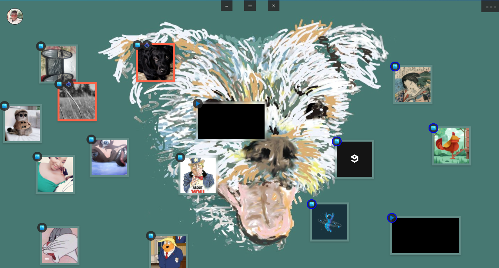
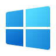

# Stash Panel

  

<!--  -->

 

## Stash Panel is a simple file sharing solution built to make the act of sharing images/videos/documents/audio etc as intuitive and seamless as possible. Just load up the windows application, register and create a new collection or join other panel collections and thats it!

 

## If you want to share a file just **Drag** it from an open window and **Drop** it on your **Panel**s **Staging** area and it will pop up on all other panels in the collection.

 
 
 
 
 
 
 

  

  
  

  
  

  
windows

  

  

  
  

  
  

  
android

  

